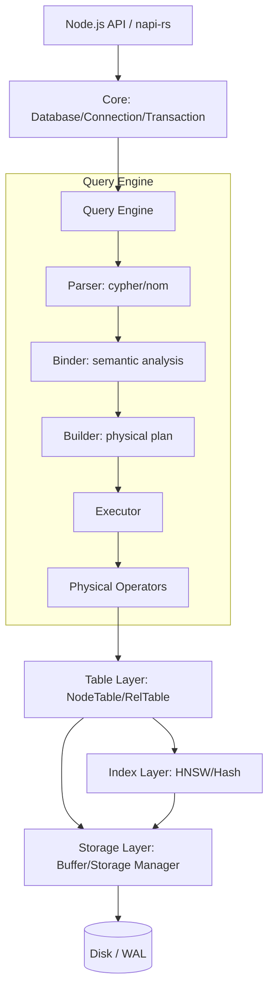

# Architecture

CongraphDB is a high-performance, embedded graph database designed for Node.js (via napi-rs). This document outlines the current architecture following the major refactoring.

## System Overview

```
┌─────────────────────────────────────────────┐
│           Node.js Application              │
│  (Business logic, API endpoints, etc.)      │
└─────────────────────────────────────────────┘
                      │
                      ▼
┌─────────────────────────────────────────────┐
│         napi-rs Bindings Layer             │
│  (lib.rs - TypeScript ↔ Rust bridge)       │
└─────────────────────────────────────────────┘
                      │
                      ▼
┌─────────────────────────────────────────────┐
│            Core Layer                       │
│  ┌──────────┐ ┌────────────┐ ┌───────────┐ │
│  │Database  │ │Connection  │ │Transaction│ │
│  └──────────┘ └────────────┘ └───────────┘ │
└─────────────────────────────────────────────┘
                      │
                      ▼
┌─────────────────────────────────────────────┐
│            Query Engine                     │
│  ┌─────────┐ ┌──────────┐ ┌─────────────┐  │
│  │ Parser  │ │ Binder   │ │ Executor    │  │
│  │ (nom)   │ │(semantic)│ │ + Operators │  │
│  └─────────┘ └──────────┘ └─────────────┘  │
└─────────────────────────────────────────────┘
                      │
                      ▼
┌─────────────────────────────────────────────┐
│      Table & Index Layer                   │
│  ┌──────────┐ ┌──────────┐ ┌────────────┐  │
│  │NodeTable │ │RelTable  │ │IndexManager│  │
│  └──────────┘ └──────────┘ └────────────┘  │
└─────────────────────────────────────────────┘
                      │
                      ▼
┌─────────────────────────────────────────────┐
│            Storage Engine                   │
│  ┌──────────┐ ┌──────────┐ ┌────────────┐  │
│  │ Buffer   │ │Storage   │ │    WAL     │  │
│  │ Manager  │ │Manager   │ │  Manager   │  │
│  └──────────┘ └──────────┘ └────────────┘  │
└─────────────────────────────────────────────┘
                      │
                      ▼
┌─────────────────────────────────────────────┐
│         .cgraph file + .wal file           │
│         (Persistent storage)                │
└─────────────────────────────────────────────┘
```

## High-Level Architecture

The system is organized into several key layers:

### 1.1 Core Layer (`src/core`)

- **Database**: The main entry point. Manages shared state (Catalog, StorageManager, BufferManager).
- **Connection**: Handles session state, transaction scope, and query execution entry points.
- **Transaction**: Implements ACID properties through a transaction manager and WAL.

### 1.2 Storage Layer (`src/storage`)

- **BufferManager**: Manages page caching and disk I/O.
- **StorageManager**: Handles page-level access to data files.
- **Catalog**: Persists schema information (Node and Relationship table definitions).
- **WAL (Write-Ahead Log)**: Ensures durability and atomic commits.

### 1.3 Table & Index Layer (`src/table`, `src/index`)

- **NodeTable**: Manages node records and property columns.
- **RelTable**: Manages relationship records, connecting source and target nodes with specific types.
- **IndexManager**: Coordinates secondary indexes (HNSW, Hash) for fast property lookups.

### 1.4 Query Engine (`src/query`)

The query engine follows a classic pipeline:

1. **Parsing (`cypher`)**: Uses `nom` to convert Cypher text into an Abstract Syntax Tree (AST).
2. **Binding (`binder`)**: Performs semantic analysis, validates labels/properties against the catalog, and binds variables to specific tables.
3. **Planning (`executor/builder`)**: Converts the bound query into a physical execution plan (operator tree).
4. **Execution (`executor/execution`)**: Coordinates the execution and manages result streaming.
5. **Operators (`operator`)**: Implementation of physical operators organized into:
   - **Streaming operators**: Scan, PatternMatch, OptionalMatch, Transform
   - **Non-streaming operators**: Aggregate, Path, PathVarLength
   - **Write operators**: Create, Merge, Delete, Update

## Component Diagram



## Core Components

### 1. napi-rs Bindings

- **File:** `src/lib.rs`
- **Purpose:** Bridge between JavaScript and Rust
- **Technology:** napi-rs with neon Serde serialization

```rust
#[napi]
impl Database {
    #[napi(constructor)]
    pub fn new(path: Option<String>) -> Self {
        // ...
    }

    #[napi]
    pub fn init(&mut self) {
        // ...
    }
}
```

### 2. Query Engine

- **Directory:** `src/query/`
- **Components:**
  - **Parser (`cypher`)**: Cypher → AST using `nom` parser combinator
  - **Binder**: Semantic analysis with modular structure:
    - `node` - Node binding logic
    - `rel` - Relationship binding logic
    - `expression` - Expression evaluation
    - `clause` - Clause-level binding
    - `pattern` - Pattern matching binding
    - `statement` - Statement-level binding
  - **Builder**: Converts bound queries to physical operator tree
  - **Executor**: Executes operator trees and manages result streaming

### 3. Storage Engine

- **Directory:** `src/storage/`
- **Components:**
  - **Buffer Manager (`buffer`)**: Page caching with LRU eviction
  - **Storage Manager**: Page-level file access
  - **Catalog (`catalog`)**: Schema persistence
  - **Page Manager**: Memory-mapped file I/O
  - **WAL (`wal`)**: Write-ahead logging for durability

### 4. Table Management

- **Directory:** `src/table/`
- **Components:**
  - **Node Table**: Columnar storage for nodes
  - **Rel Table**: Adjacency lists for relationships
  - **Chunk Manager**: Column chunk management

### 5. Index Structures

- **Directory:** `src/index/`
- **Components:**
  - **HNSW (`hnsw`)**: Vector similarity search
  - **Hash**: Fast exact match lookups

### 6. Algorithm Module

- **Directory:** `src/algorithm/`
- **Purpose:** Graph algorithms operating directly on table layer
- **Components:**
  - **Centrality**: PageRank, Betweenness, Closeness, Degree
  - **Community Detection**: Louvain, Leiden, Spectral, SLPA, Infomap, Label Propagation, Walktrap
  - **Traversal**: BFS, DFS
  - **Path**: Dijkstra, Bidirectional Dijkstra
  - **Analytics**: Triangle Count
- **Configuration**: `AlgorithmConfig` with direction, iterations, tolerance
- **Result Types**: NodeScores, NodeLabels, TraversalOrder, ShortestPaths, TriangleCount

> **See also:** [Algorithm Internals](algorithms.md) for detailed algorithm documentation.

## Recent Architecture Improvements

The recent refactoring introduced several benefits:

- **Modular Binder**: The binder is now split into `node`, `rel`, `expression`, `clause`, `pattern`, and `statement` modules, making it easier to add support for complex Cypher features.
- **Separated Query Logic**: The query execution is no longer a monolithic block. `builder.rs` and `execution.rs` have clear, distinct responsibilities.
- **Organized Operators**: Physical operators are organized into `streaming`, `non_streaming`, and `write` modules for better discoverability and maintenance.

## Recommended Architecture Enhancements

### 3.1 Logical Optimization Layer

**Status**: Missing.

**Proposal**: Introduce a `LogicalOptimizer` between the `Binder` and the `Builder`.

- **Predicate Pushdown**: Move filters as close to the scan as possible.
- **Projection Pruning**: Only read columns that are actually needed in the final result or in intermediate filters.
- **Constant Folding**: Pre-evaluate constant expressions at compile time.

### 3.2 Cost-Based Optimizer (CBO)

**Status**: Rule-based (simple translation).

**Proposal**: Implement statistics collection (node counts, property cardinality, selectivity).

- **Join Order Optimization**: Use statistics to choose which labels to scan first in complex `MATCH` patterns.
- **Index Selection**: Automatically choose between a full scan and an index lookup based on estimated cost.

### 3.3 Task-Based Execution Model

**Status**: Iterator-based (Pull model).

**Proposal**: While the current Volcano-style iterator model is simple and works well for embedded workloads, a task-based or push-based model could improve performance for highly concurrent or very large queries by better utilizing multiple cores.

### 3.4 Vector Search Integration

**Status**: Basic types exist.

**Proposal**: Deepen the integration of vector types and distance functions.

- **HNSW Index**: Add support for hierarchical navigable small world indexes for fast ANN (Approximate Nearest Neighbor) search, making CongraphDB a first-class choice for AI/RAG applications.

### 3.5 Storage Engine Abstraction

**Status**: Tightly coupled to custom page format.

**Proposal**: Define a `StorageEngine` trait to allow different storage backends (e.g., Memory-only, S3-backed cache, or pluggable compression algorithms).

## Technology Stack

| Component | Technology |
|-----------|------------|
| Language | Rust (edition 2021) |
| FFI | napi-rs |
| Parallelism | Rayon |
| Parsing | nom |
| Serialization | Serde, bincode |
| Compression | snap (Snappy) |
| Hashing | ahash |

## Data Flow

### Read Path

```
1. Application calls conn.query()
   ↓
2. Parse Cypher query (nom → AST)
   ↓
3. Bind query (semantic analysis)
   ↓
4. Build physical operator tree
   ↓
5. Execute operators (streaming/non-streaming)
   ↓
6. Read from buffer pool (or disk)
   ↓
7. Serialize results to JavaScript
   ↓
8. Return QueryResult
```

### Write Path

```
1. Application calls conn.query()
   ↓
2. Parse and bind query
   ↓
3. Build operator tree with write operators
   ↓
4. Execute write operators
   ↓
5. Write to WAL (sync)
   ↓
6. Update in-memory structures
   ↓
7. Return success
   ↓
8. Background: Checkpoint to main file
```

## Concurrency Model

### Optimistic Concurrency Control (OCC)

CongraphDB v0.1.8+ implements OCC with:
- Read/Write set tracking per transaction
- Version-based conflict detection
- LRU version cache (1000 entries default)
- Lock-free atomic version reads
- Adaptive retry system (up to 3x multiplier under contention)

### OCC Workflow

1. **Read Phase** - Record versions in read set
2. **Validation Phase** - Check versions haven't changed
3. **Write Phase** - Apply writes and increment versions
4. **Retry** - On conflict, rollback and retry with backoff

### Concurrency Model

- **Readers**: MVCC-based concurrent reads
- **Writers**: Single-writer concurrency (WAL serialization)
- **Isolation**: Serializable snapshot isolation
- **Locking**: RwLock for table access

## Memory Management

- **Buffer Pool**: Fixed-size page cache (configurable)
- **Page Size**: 4KB default
- **Eviction**: LRU with clock algorithm
- **Mapping**: Memory-mapped I/O with `memmap2`

## Error Handling

- **Strategy**: Structured errors with `thiserror`
- **Propagation**: Errors bubble through napi-rs to JavaScript
- **Recovery**: WAL replay on startup

## See Also

- [Storage Format](storage-format.md) — On-disk structure
- [Query Execution](query-execution.md) — Query processing details
- [Binder Details](binder.md) — Semantic analysis and binding
- [Operators](operators.md) — Physical operator reference
